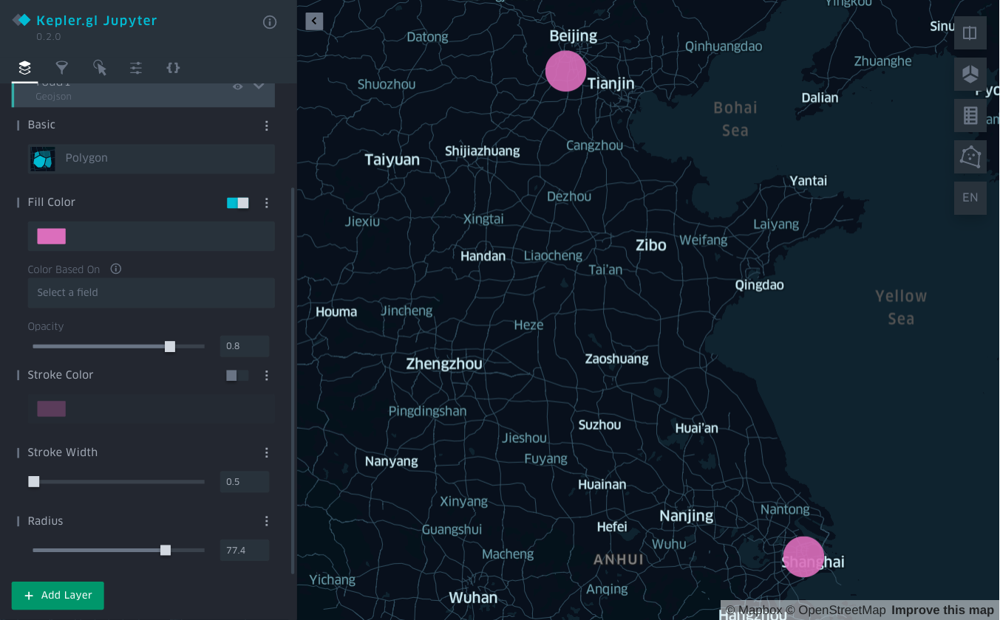

# 使用 Arctern 分析空间数据

完成 [Arctern 的安装部署](../install/standalone_installation.md) 之后，本文档引导你使用 Arctern 分析帝国大厦附近的道路信息。

### 安装 Jupyter 和 Kepler.gl

在后续步骤中，你需要使用 Jupyter Notebook 运行代码，以及使用 Kepler.gl 进行空间数据可视化。如果你的计算机未安装 Jupyter 和 Kepler.gl，请执行以下命令安装这两个工具：

```bash
# 进入 Conda 环境
$ conda activate arctern_env

# 安装 Jupyter 和 Kepler.gl
$ conda install -c conda-forge jupyterlab
$ pip install keplergl
```

## 运行 Jupyter Notebook

在 Conda 环境中运行 Jupyter Notebook，它将在你的默认浏览器中打开一个页面。

```bash
$ jupyter-notebook
```

点击页面右上角的 **New &gt; Python3** 以新建一个 Notebook。

## 运行 Arctern

### 使用 Arctern 分析道路信息

> **注意：** 以下操作均在新建的 Notebook 中运行。

导入 `arctern`、`keplergl` 以及其他的相关库：


```python
>>> from keplergl import KeplerGl
>>> import pandas as pd
>>> import arctern
```

以帝国大厦附近的两条道路为分析对象，创建 [WKT](https://en.wikipedia.org/wiki/Well-known_text_representation_of_geometry) 格式的 LINESTRING 对象（`road1`、`road2`）以表示这两条道路。

```python
>>> # road1 道路两端的经纬度坐标分别是 (-73.996324, 40.753388)、(-73.972088, 40.743215)
>>> # road2 道路两端的经纬度坐标分别是 (-73.989555, 40.741531)、(-73.973952, 40.762962)
>>> road1 = 'LINESTRING (-73.996324 40.753388, -73.972088 40.743215)'
>>> road2 = 'LINESTRING (-73.989555 40.741531, -73.973952 40.762962)'
```

使用 `GeoSeries.intersects` 方法检查 `road1` 与 `road2` 是否相交。

* 若返回 *True*，则相交；
* 若返回 *False*，则不相交。

```python
>>> geo1 = arctern.GeoSeries(road1)
>>> geo2 = arctern.GeoSeries(road2)
>>> geo1.intersects(geo2)
0    True
dtype: bool
```

### 使用 Kepler.gl 绘制地图

使用 Kepler.gl 在地图上绘制 `road1` 和 `road2`，观察这两条路是否相交：

```python
>>> KeplerGl(height=600,data={"road1":pd.DataFrame(data={"road1":[road1]}),"road2":pd.DataFrame(data={"raod2":[road2]})})
```


你还可以点击 Kepler.gl 界面右上角的 **&gt;** 按钮以展开侧边栏，在其中设置每条路线的颜色和线宽。


### 使用 Arctern 筛选信息

> **注意：** 以下操作均在新建的 Notebook 中运行。

导入 `arctern`、`keplergl` 以及其他的相关库：


```python
>>> from keplergl import KeplerGl
>>> import pandas as pd
>>> from arctern import GeoDataFrame
```

创建 `GeoDataFrame` 表示城市信息：

```python
>>> data = {
>>>     'City': ['BeiJing', 'ShangHai', 'Tokyo', 'Seoul'],
>>>     'Country': ['China', 'China', 'Japan', 'Korea'],
>>>     'Coordinates': ['POINT(116.24 39.55)', 'POINT(121.29 31.14)', 
>>>                     'POINT(139.49 35.40)', 'POINT(126.58 37.33)']
>>> }
>>> df = GeoDataFrame(data, geometries=["Coordinates"], crs="EPSG:4326")
```

筛选出 `Country == "China"` 的城市信息:
```python
>>> in_china = pd.Series([df.Country[idx] == "China" for idx in range (0, len(df))])
>>> df_in_china = df[in_china]
>>> df_in_china
	City	Country	Coordinates
0	BeiJing	China	POINT (116.24 39.55)
1	ShangHai	China	POINT (121.29 31.14)
```

### 使用 Kepler.Gl 绘制地图

使用 Kepler.Gl 在地图上标示出 `Beijing` 和　`ShangHai` 两个城市：

```python
>>> KeplerGl(height=600, data={"citys":pd.DataFrame(rst.Coordinates.to_wkt())})
```

